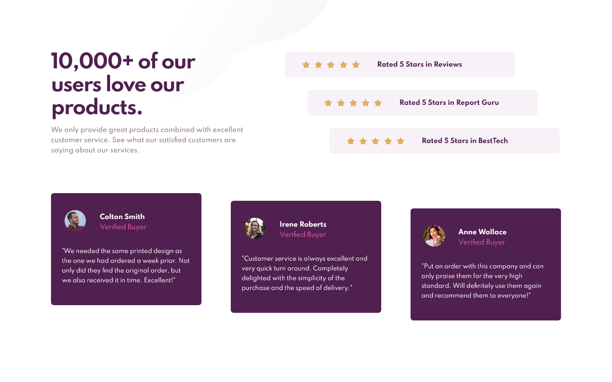

# Frontend Mentor - Social proof section solution
Esta es la solución al reto de [Social proof section challenge on Frontend Mentor](https://www.frontendmentor.io/challenges/social-proof-section-6e0qTv_bA). Los desafíos de Frontend Mentor  ayudan a mejorar las habilidades de codificación mediante la construcción de proyectos realistas.

## Tabla de contenido

- [Información-general](#Información-general)
  - [El-desafío](#El-desafío)
  - [Capturas-de-pantalla](#Capturas-de-pantalla)
  - [Mi-proceso](#Mi-proceso)
  - [Construido-con ](#Construido-con)
  - [Lo-que-aprendí](#Lo-que-aprendí)
  - [Desarrollo-continuo](#Desarrollo-continuo)
  - [Recursos-utiles](#Recursos-utiles)
  - [Autor](#Autor)

## Información-general

### El-desafío

Los usuarios deben poder:

- Ver el diseño óptimo para la sección según el tamaño de pantalla de su dispositivo.
- desktop: 1440px.
- mobile: 375px.

### Capturas-de-pantalla

 

## Mi-proceso

### Construido-con 

- HTML5
- CSS personalizado
- Flexbox
- Mobile-first workflow

### Lo-que-aprendí

 - Al utilizar la filosofía de "mobile first" me di cuenta que, al pasar el diseño a versión de escritorio me faltaban contenedores para poder ubicar y manipular los elementos, ya que en la versión mobile esos contenedores no eran imprescindibles, por consecuencia de utilizar flex-direction: column al seguir el flujo normal del html los elementos se posicionan en el orden correcto pero en la version de escritorio necesité modificar y adaptar mi estructura html para tener mayor control en los elementos y poder posicionar todos los elementos en las dos resoluciones exigidas por el reto.

 - En vez de agregarle el mismo borde exterior e interior a todos los elementos para lograr una alineacion compartida, se lo agregé directamente a la etiqueta body del documento. Esto simplificó mi codigo css.

 - Comencé a utilizar la unidad de medida relativa "em" para todas aquellas propiedades que cambian con el font-size del elemento (por lo general en el eje vertical) y "rem" para las propiedades que no varían con el font-size del elemento (eje horizontal).

- Dejé de utilizar la unidad de medida viewport-height y viewport-width para definir tamañanos absolutos, los utilizo para definir tamaños mínimos y máximos.

- Aprendí a utilizar la pseudo-clase nth-child y a seleccionar un elemento particular del mismo de la siguiente manera: 
  .card:nth-child(0n+ numero-del-elemento) {}

### Desarrollo-continuo

- No logro cambiar el tamaño de las imágenes utilizadas para los patrones del fondo. Estoy utilizando los pseudo-elementos after y before para representar dichas imágenes.

### Recursos-utiles
- https://www.w3schools.com/
- https://developer.mozilla.org/en-US/docs/Web/CSS
- https://www.udemy.com/

## Autor

- Frontend Mentor - https://www.frontendmentor.io/profile/eduviana
- Email - eduardoviana83@gmail.com

